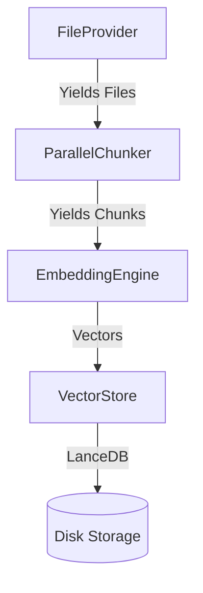
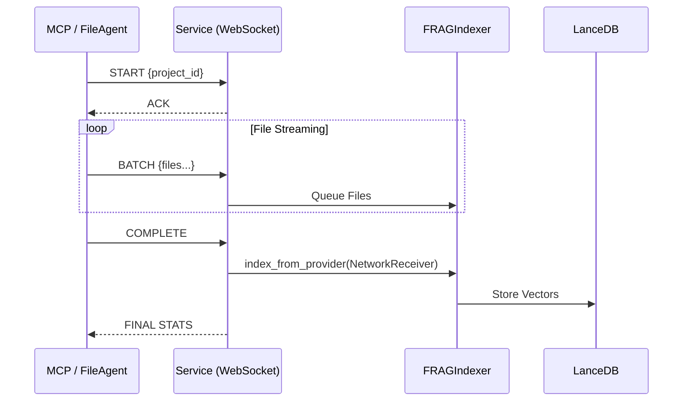
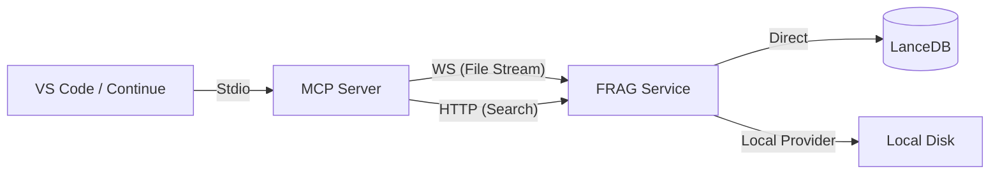

# RAG Service Current Design Architecture

## Overview
The RAG (Retrieval‑Augmented Generation) service in this repository consists of three tightly integrated layers:
1. **FRAG Core** – fast indexing, embedding, and search pipeline.
2. **FRAG Service / Web UI** – a thin FastAPI proxy that exposes REST endpoints and serves the UI.
3. **MCP RAG Server** – wraps the FRAG Service as MCP tools for the Continue IDE, enabling seamless tool‑driven interactions.

---

## 1. FRAG Core Components
The core logic resides in `FRAG/src/` and is designed around modular abstractions to support both local and remote operations seamlessly.

| Component | Class | Responsibility |
|-----------|-------|----------------|
| **Indexer** | `FRAGIndexer` | The central orchestrator. Manages the lifecycle of scanning, chunking, embedding, and storage. It is agnostic to where files come from (via `FileProvider`) or where vectors go (via `VectorStore`). |
| **Embedding** | `EmbeddingEngine` | High-performance GPU embedding. Features adaptive batch sizing to saturate GPU memory without OOM, supports semi-dynamic batching, and handles both FP16 and BF16 precision. |
| **Chunking** | `ParallelChunker` | A multiprocessing-based chunker that spawns worker processes to tokenize and split files on CPU cores, achieving ~1.8x speedup over sequential processing. |
| **Reranking** | `Reranker` | Optional cross-encoder stage (using `Reranker` class) that re-scores top-K semantic search results for higher precision. |

### Data Flow (FRAG Core)

---

## 2. Abstraction Layers (Local vs. Remote)

A key architectural feature is the ability to decouple **where code lives** from **where processing happens**. This is achieved through two primary abstractions: the **Transport Layer** (for files) and the **Storage Layer** (for vectors).

### 2.1 File Transport Layer
This layer handles how source code is delivered to the indexing engine.

*   **`FileProvider` Protocol** (`file_provider.py`):
    *   Abstract base class defining `get_files() -> Generator[path, content]`.
    *   **`LocalFileProvider`**: Scans the local filesystem directly using `rglob`, respecting `.gitignore` and config patterns.
    *   **`NetworkReceiver`** (Server-side): Implements `FileProvider` but receives file content over a WebSocket connection. It buffers batches of files and yields them to the indexer, allowing the indexer to treat network streams exactly like local disk reads.

*   **`FileTransport` & `NetworkTransport`** (`file_transport.py`):
    *   **`LocalTransport`**: No-op wrapper for local usage.
    *   **`NetworkTransport`** (Client-side): Handles the complex logic of streaming files to a remote server. It manages:
        *   **Batching**: Groups small files into optimal network payloads (default 500 files/batch).
        *   **Compression**: Optional GZIP compression for bandwidth checking.
        *   **Protocol**: Implements a robust state machine (`start` -> `batch` loop -> `complete`) with ACK/NACK handling to ensure integrity.

### 2.2 Vector Storage Layer
This layer abstracts where the embeddings are persisted.

*   **`VectorStore` Protocol** (`vector_store.py`):
    *   Defines unified `store_chunks()` and `search()` methods.
*   **`LocalVectorStore`** (`local_vector_store.py`):
    *   Directly interacts with the local LanceDB instance on the server's disk.
    *   Manages LanceDB tables (one per project: `project_{id}_chunks`).
*   **`RemoteVectorStore`** (`remote_vector_store.py`):
    *   Used by thin clients (like the MCP server) to offload storage.
    *   Proxies `store_chunks` calls to the `/frag/store` HTTP endpoint.
    *   Proxies `search` calls to the `/frag/search/embedding` endpoint.

---

## 3. FRAG Service & Web UI
The service layer exposes the Core functionality over HTTP and WebSocket protocols.

- **`FRAG/src/web_app.py`** – FastAPI app that mounts static files (`static/`) and proxies all API calls to the FRAG Service.
- **`FRAG/src/frag_service.py`** – The main entry point.
    - **HTTP Endpoints**:
        - `/projects/{id}/index`: Triggers background indexing.
        - `/search`: Semantic search endpoint.
        - `/frag/store`: **Remote Storage** endpoint. Receives pre-embedded vectors and writes them to the local LanceDB.
    - **WebSocket Endpoint** (`/ws/file-agent`):
        - **Remote Indexing**. Accepts a stream of files from a client (e.g., FileAgent or MCP Server).
        - Uses `_batch_processor` to feed received files into `FRAGIndexer.index_from_provider()`.

### Request Flow (Remote Indexing)

---

## 4. MCP RAG Server
The MCP Server (`mcp-rag-server/frag_mcp/server.py`) acts as the bridge to the IDE.

- **Tool Exposure**: Exports `search`, `index_workspace`, etc., as standard MCP tools.
- **Client Mode**: Is capable of acting as a "smart client" using `NetworkTransport` to push local files to the remote FRAG Service for indexing. 
- **Codebase**: It does **not** rely on `FRAGCore` locally; instead, it uses `FRAGClient` to communicate with the service.

### MCP ↔ FRAG Interaction Diagram

---

## 5. Configuration Points
- **`FRAG_SERVICE_URL`** – URL of the FRAG Service (default `http://localhost:8001`).
- **`FRAGConfig`** (`frag_config.py`) – Controls hardware settings:
    - `embedding_batch_size`: Auto-tuned for GPU VRAM.
    - `use_fp16/bf16`: Precision settings.
    - `chunk_size`: Typically 1024 tokens.
- **Project Configuration**:
    - `projects.yaml`: Registry of known projects (for persistent server-side projects).
    - Ad-hoc projects can be created dynamically via the API.

---

## 6. Verification & Future Work
- **Current State** – All components are operational. The Transport abstraction allows seamless switching between local file scanning (server-side git repos) and remote file streaming (developer laptop -> server).
- **Planned Enhancements**
  - **Incremental Indexing**: Using file hashes (MD5/SHA) in the `FileProvider` to skip unchanged files.
  - **Metadata Extraction**: Enhancing `ParallelChunker` to use Tree-sitter for extracting symbol information (classes, functions) to improve retrieval context.
  - **Offline/Airgapped Mode**: Packaging the entire stack (MCP + FRAG Service + Models) for secure environments.

*Document updated on 2025‑12‑20.*
