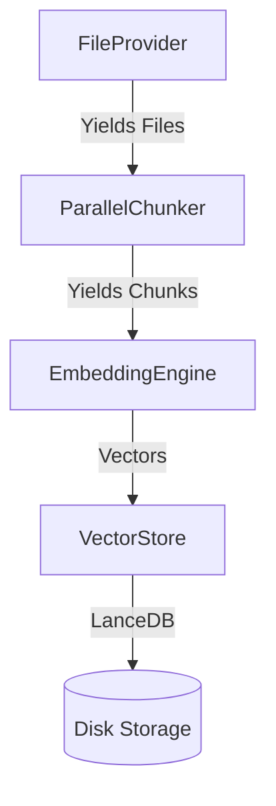

# FRAG (Fast Retrieval-Augmented Generation)

High-performance RAG indexing and search for the AI-Lab cluster.

---

## Documentation

| Document | Description |
|----------|-------------|
| [🏗️ Architecture](architecture) | FRAG Core, Service, and MCP integration |
| [📊 Embedding Benchmarks](/ai-lab/benchmarks/embedding) | Model comparison and performance tuning |

---

## Key Features

- **Parallel Chunking**: Multi-process tokenization (~1.8x speedup)
- **GPU Embedding**: Direct HuggingFace/PyTorch with adaptive batching
- **Multi-GPU**: DataParallel across RTX 5090s/3090s
- **Quality Presets**: good/better/best with calibrated settings
- **Remote Indexing**: Stream files over WebSocket

---

## Architecture Overview

---

## Performance Summary

| Quality | Model | Embed Rate | MTEB Score |
|---------|-------|------------|------------|
| **good** | bge-small | 1,576/s | 62.3 |
| **better** | bge-base | 970/s | 64.2 |
| **best** | bge-large | 390/s | 64.6 |

**Recommendation**: Use **"better"** for production - 97% quality at 2.5x speed.

---

*Fast indexing, accurate retrieval.*
