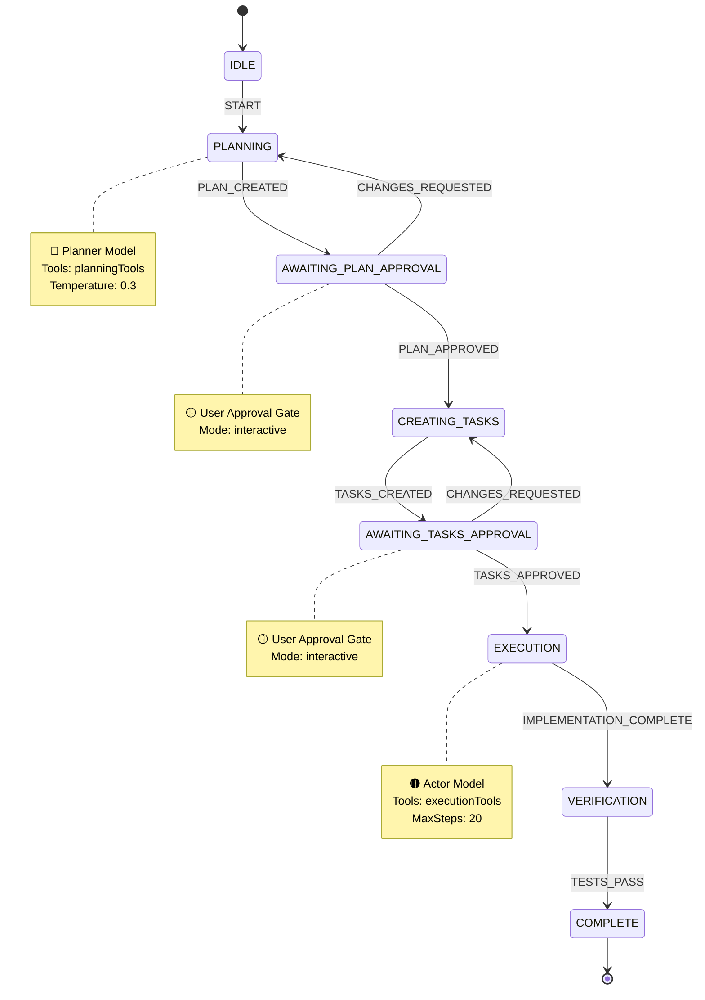
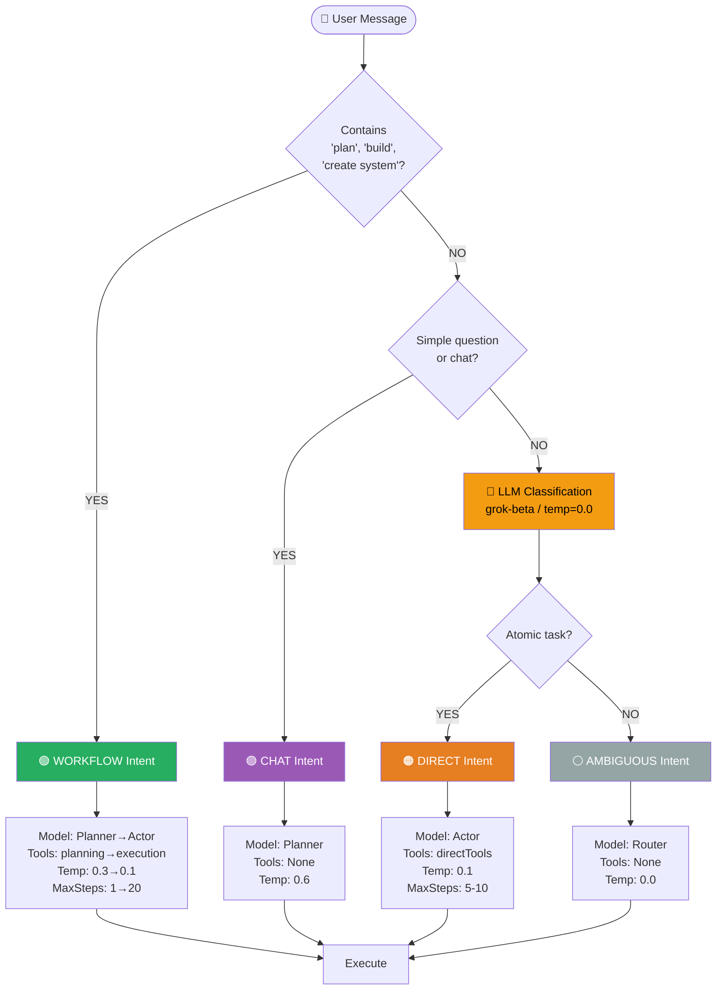
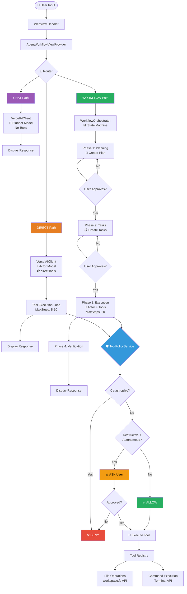
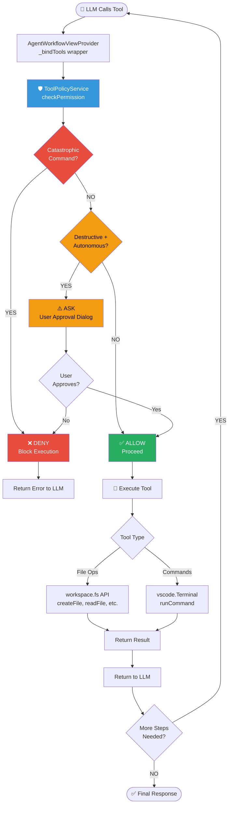

# Workflow State Machine Diagram



---

# Router Decision Flow



---

# Complete Execution Flow



---

# Tool Execution Security Flow



---

## How to View These Diagrams

### Option 1: GitHub/GitLab (Automatic Rendering)
These Mermaid diagrams render automatically in markdown on GitHub/GitLab.

### Option 2: VS Code (Mermaid Extension)
1. Install "Markdown Preview Mermaid Support" extension
2. Open this file and preview (Ctrl+Shift+V)

### Option 3: Online Editor
Copy diagram code to https://mermaid.live/

### Option 4: Generate PNG
```bash
# Install mermaid-cli
npm install -g @mermaid-js/mermaid-cli

# Generate images
mmdc -i diagrams.md -o workflow-state-machine.png
```

---

## Diagram Legend

| Symbol | Meaning |
|--------|---------|
| 🟢 | Safe / Approved path |
| 🟡 | Caution / Approval required |
| 🟠 | Action / Execution phase |
| 🔵 | Planning / Analysis phase |
| ⚪ | Neutral / Ambiguous |
| 🛡️ | Security checkpoint |
| ✅ | Allowed |
| ⚠️ | Warning / Ask user |
| ❌ | Denied / Blocked |
| 🤖 | LLM / AI component |
| 🔧 | Tool execution |
| 📊 | State machine |
| 🎯 | Router / Decision point |
