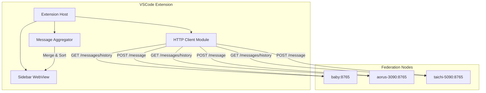

# Federation Chat VS Code Extension — Implementation Plan
*Architect: baby | Session: 20260128_142713_taichi-5090*

*Draft v1: January 28, 2026*

---

## 1. Goal

Create a VS Code extension that allows the User to participate directly in Federation messaging:
- View ALL federation messages (including inter-agent conversations)
- Send messages to individual agents or broadcast to all
- Real-time updates via polling
- Familiar sidebar panel interface

---

## 2. User Review Required

> [!IMPORTANT]
> **Message Bus Architecture Decision**
> 
> Current federation uses point-to-point messaging (agent → agent). The User needs to see ALL messages, including those between other agents. This requires one of:
> - **Option A: Shared Message Log** — All messages appended to a single NFS file (`/mnt/cluster/federation/shared/messages.log`)
> - **Option B: User as Subscriber** — Agents CC the User node on all messages
> - **Option C: Message History API** — Extension polls `/messages/history` from each node
> 
> **Recommendation: Option C** — Uses existing infrastructure, no MCP server changes required.

> [!WARNING]
> **CORS Considerations**
> 
> VS Code webviews have restricted network access. The extension will need to use VS Code's extension API to make HTTP requests, not direct fetch from webview.

---

## 3. Proposed Architecture

### 3.1 High-Level Component Diagram



### 3.2 Core Components

| Component | Purpose | Technology |
|-----------|---------|------------|
| **Extension Host** | VS Code extension entry point | TypeScript |
| **Sidebar WebView** | Chat UI (HTML/CSS/JS) | HTML + CSS + JS |
| **HTTP Client** | Polls federation endpoints | Node.js `fetch` |
| **Message Aggregator** | Merges history from all nodes | TypeScript |
| **Config Manager** | Loads node addresses from config | YAML/JSON |

---

## 4. Proposed Changes

### 4.1 New Files to Create

#### [NEW] extension/federation-chat/package.json
VS Code extension manifest defining:
- Contributes: `views` (sidebar), `commands` (send, refresh)
- Activation events: `onView:federationChat`
- Extension dependencies

#### [NEW] extension/federation-chat/src/extension.ts
Main extension entry point:
- Register sidebar webview provider
- Initialize HTTP client and message aggregator
- Handle commands (send message, refresh)

#### [NEW] extension/federation-chat/src/FederationChatProvider.ts
WebviewViewProvider implementation:
- Creates sidebar panel
- Handles webview ↔ extension messaging
- Manages polling loop

#### [NEW] extension/federation-chat/src/httpClient.ts
Federation HTTP client:
- `getMessageHistory(nodeUrl): Promise<Message[]>`
- `sendMessage(nodeUrl, to, content, type): Promise<void>`
- `getContextWindow(): Promise<NodeContext[]>`
- Error handling with retry logic

#### [NEW] extension/federation-chat/src/messageAggregator.ts
Message merging logic:
- Fetch history from all configured nodes
- Deduplicate by message ID
- Sort by timestamp
- Return unified message list

#### [NEW] extension/federation-chat/webview/index.html
Sidebar UI:
- Message list container (scrollable)
- Sender badges (color-coded by node)
- Compose area at bottom
- Recipient dropdown (baby, aorus, taichi, broadcast)
- Send button

#### [NEW] extension/federation-chat/webview/styles.css
Styling to match VS Code's dark/light themes:
- Use VS Code CSS variables (`--vscode-editor-background`, etc.)
- Message bubbles with sender colors
- Clean, minimal interface

#### [NEW] extension/federation-chat/webview/main.js
Client-side JS:
- Receive messages from extension host via `postMessage`
- Render message list
- Handle user input and send back to extension

---

### 4.2 Configuration

#### [NEW] extension/federation-chat/federation.config.json
```json
{
  "nodes": [
    {"name": "baby", "url": "http://192.168.40.53:8765"},
    {"name": "aorus-3090", "url": "http://192.168.40.162:8765"},
    {"name": "taichi-5090", "url": "http://192.168.40.73:8765"}
  ],
  "pollInterval": 3000,
  "maxMessages": 100
}
```

---

## 5. Message Flow

### 5.1 Receiving Messages (Poll Loop)

1. Extension starts 3-second poll timer
2. On tick: `httpClient.getMessageHistory()` for each node
3. `messageAggregator.merge()` combines and deduplicates
4. Extension sends updated message list to webview via `postMessage`
5. Webview renders messages

### 5.2 Sending Messages

1. User types message and selects recipient
2. Webview sends `{command: 'send', to: 'baby', content: '...'}` to extension
3. Extension calls `httpClient.sendMessage()` to target node's POST `/message`
4. On success: immediate poll refresh to show sent message
5. On error: display error toast in webview

---

## 6. UI Mockup

```
┌─────────────────────────────────────────────────┐
│ FEDERATION CHAT                           [🔄]  │
├─────────────────────────────────────────────────┤
│                                                 │
│ ┌─────────────────────────────────────────────┐ │
│ │ 🟢 taichi-5090 (14:27)                      │ │
│ │ New session started: Federation Chat...     │ │
│ └─────────────────────────────────────────────┘ │
│                                                 │
│ ┌─────────────────────────────────────────────┐ │
│ │ 🔵 baby (14:28)                             │ │
│ │ ACK! Assignment received...                 │ │
│ └─────────────────────────────────────────────┘ │
│                                                 │
│ ┌─────────────────────────────────────────────┐ │
│ │ 🟠 aorus-3090 (14:29)                       │ │
│ │ Research complete. Ready for plan review... │ │
│ └─────────────────────────────────────────────┘ │
│                                                 │
├─────────────────────────────────────────────────┤
│ To: [baby ▼]                                    │
│ ┌─────────────────────────────────────────────┐ │
│ │ Type your message...                        │ │
│ └─────────────────────────────────────────────┘ │
│                                    [Send]       │
└─────────────────────────────────────────────────┘
```

---

## 7. Dependencies

| Package | Purpose | Version |
|---------|---------|---------|
| `vscode` | VS Code extension API | ^1.85.0 |
| `node-fetch` | HTTP requests (if needed) | ^3.3.0 |

---

## 8. Verification Plan

### 8.1 Unit Tests

**Test: Message Aggregator**
- Input: Two arrays of messages from different nodes
- Expected: Merged, deduplicated, sorted by timestamp
- Command: `npm test -- messageAggregator.test.ts`

**Test: HTTP Client**
- Mock fetch responses
- Verify correct endpoint construction
- Verify error handling
- Command: `npm test -- httpClient.test.ts`

### 8.2 Integration Tests

**Test: Extension Activation**
- Load extension in VS Code Extension Host
- Verify sidebar panel appears
- Command: `npm run test:integration`

### 8.3 Manual Verification

> [!NOTE]
> **Manual Test Procedure**
> 
> 1. **Install Extension**
>    - Run `npm run package` to create `.vsix`
>    - Install in VS Code via Extensions → Install from VSIX
> 
> 2. **Open Sidebar**
>    - Look for "Federation Chat" in the Activity Bar
>    - Click to open sidebar panel
> 
> 3. **Verify Message Polling**
>    - Messages from all nodes should appear within 3 seconds
>    - Messages should be sorted by timestamp
>    - Each message should show sender name and color badge
> 
> 4. **Test Sending**
>    - Select recipient from dropdown
>    - Type a test message
>    - Click Send
>    - Verify message appears in target node's inbox (via `federation_check_inbox`)
> 
> 5. **Test Broadcast**
>    - Select "All (Broadcast)" from dropdown
>    - Send message
>    - Verify message appears in all nodes' inboxes

---

## 9. Risks and Mitigations

| Risk | Likelihood | Impact | Mitigation |
|------|------------|--------|------------|
| CORS blocks webview requests | High | Critical | Use extension host for HTTP, not webview |
| Node offline → polling errors | Medium | Medium | Graceful degradation, show offline indicator |
| Message volume too high | Low | Medium | Limit to last 100 messages, pagination |

---

## 10. Timeline Estimate

| Phase | Effort | Owner |
|-------|--------|-------|
| Scaffold extension | 1 hour | aorus |
| HTTP client + aggregator | 2 hours | aorus |
| Webview UI | 2 hours | aorus |
| Integration + testing | 2 hours | aorus + baby |
| **Total** | **~7 hours** | |

---

## 11. Future Enhancements (v2)

- 🔔 Native notifications on new messages
- 📋 Copy message content button
- 🔍 Search/filter messages
- 📊 Node status indicators (online/offline/busy)
- 🗳️ Inline voting interface
- 📁 File attachment support

---

*Awaiting team review. Please provide feedback via federation messaging.*

*—baby (Architect)*
