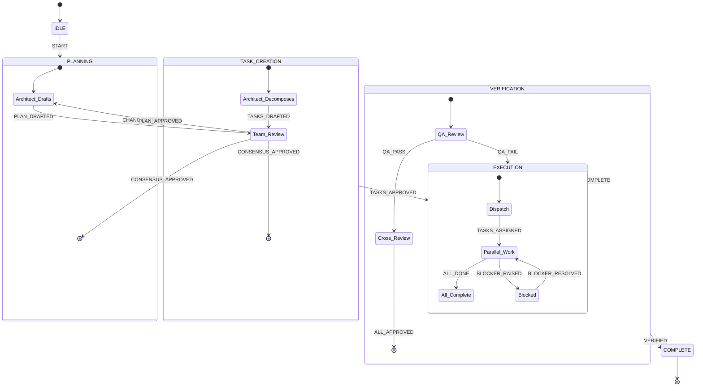

# Agent Workflow State Machine

> Visual representation of `/external_projects/kinetic-agent-config/workflow/state_machine.json`

## State Diagram

```mermaid
stateDiagram-v2
    [*] --> IDLE
    
    IDLE --> PLANNING: START [interactive]
    IDLE --> EXECUTION: START [autonomous]
    
    PLANNING --> AWAITING_PLAN_APPROVAL: PLAN_CREATED
    
    AWAITING_PLAN_APPROVAL --> CREATING_TASKS: PLAN_APPROVED
    AWAITING_PLAN_APPROVAL --> PLANNING: CHANGES_REQUESTED
    
    CREATING_TASKS --> AWAITING_TASKS_APPROVAL: TASKS_CREATED
    
    AWAITING_TASKS_APPROVAL --> EXECUTION: TASKS_APPROVED
    AWAITING_TASKS_APPROVAL --> CREATING_TASKS: CHANGES_REQUESTED
    
    EXECUTION --> VERIFICATION: IMPLEMENTATION_COMPLETE
    
    VERIFICATION --> COMPLETE: TESTS_PASS
    VERIFICATION --> EXECUTION: CHANGES_REQUESTED
    
    COMPLETE --> [*]
    
    note right of IDLE: Global events:\n- ARTIFACT_ADDED\n- ADD_COMMENT\n- CLEAR_COMMENTS\n- RESET
```

## State Descriptions

| State | Description | Exit Events |
|-------|-------------|-------------|
| **IDLE** | Waiting for work | `START` |
| **PLANNING** | Analyzes request, creates Implementation Plan | `PLAN_CREATED` |
| **AWAITING_PLAN_APPROVAL** | Waiting for user approval of plan | `PLAN_APPROVED`, `CHANGES_REQUESTED` |
| **CREATING_TASKS** | Converts approved plan into Task List | `TASKS_CREATED` |
| **AWAITING_TASKS_APPROVAL** | Waiting for user approval of tasks | `TASKS_APPROVED`, `CHANGES_REQUESTED` |
| **EXECUTION** | Executes tasks autonomously | `IMPLEMENTATION_COMPLETE` |
| **VERIFICATION** | Tests and verifies implementation | `TESTS_PASS`, `CHANGES_REQUESTED` |
| **COMPLETE** | Final state | — |

## Flow Diagram (Simplified)

```
┌─────────────────────────────────────────────────────────────────────────────┐
│                                                                             │
│   ┌──────┐    START     ┌──────────┐   PLAN_CREATED   ┌─────────────────┐  │
│   │ IDLE │─────────────▶│ PLANNING │─────────────────▶│ AWAIT APPROVAL  │  │
│   └──────┘              └──────────┘                  │   (Plan)        │  │
│      │                       ▲                        └────────┬────────┘  │
│      │                       │                                 │           │
│      │ [autonomous]          │ CHANGES                         │ APPROVED  │
│      │                       │ REQUESTED                       ▼           │
│      │                       │                        ┌─────────────────┐  │
│      │                       └────────────────────────│ CREATING_TASKS  │  │
│      │                                                └────────┬────────┘  │
│      │                                                         │           │
│      │                                                         ▼           │
│      │                                                ┌─────────────────┐  │
│      │                                                │ AWAIT APPROVAL  │  │
│      │                                                │   (Tasks)       │  │
│      │                                                └────────┬────────┘  │
│      │                                                         │           │
│      │                                                         │ APPROVED  │
│      │                                                         ▼           │
│      └───────────────────────────────────────────────▶┌─────────────────┐  │
│                                                       │   EXECUTION     │◀─┤
│                                                       └────────┬────────┘  │
│                                                                │           │
│                                                                ▼           │
│                                                       ┌─────────────────┐  │
│                                       CHANGES_REQ     │  VERIFICATION   │  │
│                                       ────────────────│                 │  │
│                                                       └────────┬────────┘  │
│                                                                │           │
│                                                                │ TESTS_PASS│
│                                                                ▼           │
│                                                       ┌─────────────────┐  │
│                                                       │    COMPLETE     │  │
│                                                       └─────────────────┘  │
└─────────────────────────────────────────────────────────────────────────────┘
```

---

## Team Applicability Analysis

### Current Design: Single Agent

The state machine was designed for a **single agent** workflow:
- One agent plans → creates tasks → executes → verifies
- "User" is the approval gate
- Linear flow with one executor

### Adapting for Team (Multi-Agent)

| Current Concept | Team Adaptation |
|-----------------|-----------------|
| Agent creates plan | **Architect** creates plan |
| User approves plan | **Team Leader** or **Consensus Vote** approves |
| Agent creates tasks | **Architect** decomposes into tasks |
| User approves tasks | **Team consensus** or **Leader** approves |
| Agent executes | **Multiple workers** execute in parallel |
| Agent verifies | **QA role** or **cross-review** |

### Required Modifications

#### 1. Add Role Context
```json
"EXECUTION": {
    "parallel": true,
    "actors": ["architect", "developer", "qa"],
    "on": {
        "ALL_TASKS_COMPLETE": "VERIFICATION"
    }
}
```

#### 2. Replace "User" with Team Consensus
```json
"AWAITING_PLAN_APPROVAL": {
    "approval_mechanism": "consensus",
    "threshold": 0.67,
    "on": {
        "CONSENSUS_REACHED": "CREATING_TASKS"
    }
}
```

#### 3. Add Parallel Execution Tracking
```json
"EXECUTION": {
    "sub_states": {
        "per_task": ["ASSIGNED", "IN_PROGRESS", "DONE", "FAILED"]
    },
    "completion_rule": "all_done_or_failed"
}
```

### Proposed Team State Machine



### Key Differences for Team

| Aspect | Single Agent | Team |
|--------|--------------|------|
| **Approval** | User clicks approve | Consensus vote (federation_consensus_*) |
| **Execution** | Sequential | Parallel (COP tracking via federation_pulse) |
| **Communication** | Internal context | federation_send, extension_send_message |
| **Blocking** | Wait for user | Raise BLOCKER, team helps |
| **Verification** | Self-review | Cross-review by different role |

### Mapping to Federation Tools

| State Machine Event | Federation Tool |
|---------------------|-----------------|
| `START` | `extension_create_conversation` |
| `PLAN_CREATED` | Store in artifacts table |
| `PLAN_APPROVED` | `federation_consensus_results` shows approval |
| `TASKS_CREATED` | `federation_propose_task` for each |
| Task claimed | `federation_claim_task` |
| Progress update | `federation_update_state` |
| Monitor progress | `federation_pulse` |
| Phase change | `federation_advance_phase` |

---

## Verdict

**Yes, it's applicable to teams** with modifications:

1. ✅ Phase gates → **Consensus votes**
2. ✅ Single executor → **Parallel workers with COP**
3. ✅ User approval → **Team leader or vote threshold**
4. ⚠️ Need to add: **Role assignment at each phase**
5. ⚠️ Need to add: **Parallel task tracking in EXECUTION**

The core flow (Plan → Approve → Tasks → Approve → Execute → Verify → Complete) translates directly to team workflows.
