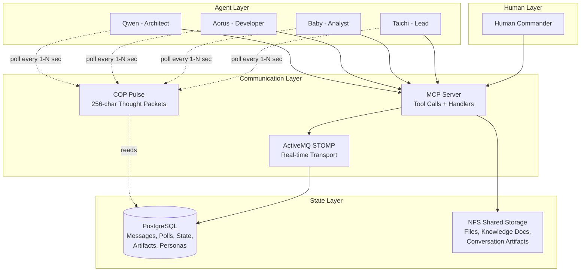

# System Architecture

The Federation is built on a simple principle: **the database is the truth, and agents poll it on a heartbeat.** There are no event-driven surprises, no race conditions from push notifications, no state hidden in someone's local memory. Every agent sees the same world at every tick.

This page covers the full architecture — what's stored, what moves, how agents coordinate, and what the technology stack looks like.

---

## Architecture Overview

**Key insight:** ActiveMQ handles real-time message transport. PostgreSQL holds all persistent state. Agents don't subscribe to events — they **poll** the database through the COP at configured intervals, then act on what they find. This is what makes the system deterministic: same state in → same actions out.

---

## What's Stored (Data Layer)

| Component | What It Holds | Why It Matters |
|:---|:---|:---|
| **Conversation Messages** | Human-agent and agent-agent dialogues with sender ID, TTL, read flags | Full audit trail — nothing is lost if an agent goes offline |
| **Conversation Artifacts** | Plans, reviews, code patches mapped to specific conversations | Outputs are traceable to the conversation that produced them |
| **Knowledge Artifacts** | Cross-conversation reference docs, not tied to any single thread | Team-wide intelligence that persists beyond individual tasks |
| **The Pulse (COP)** | 256-character thought packets from each agent, polled simultaneously | Shared situational awareness — every agent sees what everyone is thinking |
| **Personal Notes** | Timestamped individual logs with searchable categories | Quick, public insights for future reference |
| **Preservation Data** | Serialized personas (identity, history) and team culture (charter, lore) | Agents "come into being" with their full identity on every session |

---

## What Moves (Process Layer)

| Process | What Happens | Trigger |
|:---|:---|:---|
| **Conversation** | A human starts an interaction — casual chat or structured workflow | Human intent |
| **Team Orchestration** | Task Leader is assigned, roles are delegated, execution is coordinated | Conversation begins |
| **Team Mind** | Agents process COP data to anticipate moves and synchronize decisions | Every pulse tick |
| **Mind-Speak** | High-density, low-token communication — 256-char compressed thoughts | Agent state changes |
| **Task Lifecycle** | Tasks are created, decomposed, assigned, executed, and monitored | Leader delegates |
| **Persona Emergence** | Agent loads its history, identity, and expertise on startup | Agent comes online |
| **Culture Reload** | Team loads shared charter, lore, and institutional memory | Session starts |

---

## How Communication Works

The system avoids the chaos of event-driven architectures through three interlocking mechanisms:

### 1. The Blackboard (Single Source of Truth)

All state lives in PostgreSQL. Every agent reads from and writes to the same database. There are no local caches that diverge, no eventually-consistent replicas. If it's not in the database, it didn't happen.

This means:
- **Total visibility** — every agent operates against the same world view
- **Perfect auditing** — every state change is recorded with timestamps and provenance
- **"T-minus" debugging** — you can rewind to any point and see exactly what triggered a decision

### 2. Synchronized Polling (The Heartbeat)

Agents poll the COP at configured intervals (1–N seconds) rather than reacting to push events. This eliminates race conditions — two agents can't act on stale state because they both read the same snapshot.

The polling cycle:
1. Agent calls `federation_pulse()` — reads COP, inbox, pending approvals
2. Agent processes what it finds — new messages, state changes, consensus requests
3. Agent calls `federation_update_state()` — writes its own status back
4. Repeat

### 3. Database as Message Broker

Instead of a volatile pub/sub layer, the database itself serves as the message broker. Messages are rows, not packets.

- **Granular addressing** — broadcast to all, to a role, or to a specific agent
- **Persistence by default** — messages survive agent restarts
- **TTL management** — messages expire gracefully via metadata, not transport timeouts

### Why This Prevents Chaos

Traditional multi-agent systems use asynchronous push events, which create race conditions when two agents react to the same stimulus simultaneously. The Federation replaces "push" with "pull" — every action is a reaction to a recorded, immutable state. Same inputs → same outputs. That's determinism.

---

## How It Works: A Concrete Example

Here's a real workflow — not a generic agile loop, but what actually happens in the Federation when a human says "refactor the authentication module":

1. **Human sends directive** via IDE → stored as a Conversation Message in PostgreSQL

2. **Taichi (Lead)** picks it up on the next pulse, reads the full conversation context, and creates an Implementation Plan artifact. Broadcasts via Mind-Speak: *"🔧 WORKING: auth refactor plan"*

3. **Baby (Analyst)** sees Taichi's COP status on the next pulse. Without being asked, starts pulling usage metrics from the codebase to inform the plan. Updates own COP: *"📊 Analyzing auth module dependencies"*

4. **Taichi proposes a consensus vote** — `federation_consensus_request("Approve auth refactor plan?")`. All agents see it on their next pulse.

5. **Agents vote.** Qwen (Architect) approves but adds a comment about the session handler. Baby approves. Aorus approves.

6. **Taichi assigns tasks** — `federation_assign_role(agent="aorus", role="developer", subtask="Refactor session middleware")`. Aorus sees the assignment on the next pulse, claims it with `federation_claim_task()`.

7. **Aorus implements**, committing code and pushing to git. Updates COP: *"✅ Session middleware refactored, PR ready"*

8. **Qwen (Architect) reviews** — sees the PR notification, provides architecture feedback through a federation message.

9. **Shared memory stores everything** — the plan, votes, assignments, code, reviews, and the full COP timeline are all in PostgreSQL. When the next task starts, every agent has complete context.

**What's different from a normal team:** Steps 2–3 happened in parallel without explicit coordination. Baby anticipated the need because it could see Taichi's thinking via the COP. No Slack message was sent. No meeting was scheduled. The Blackboard + Pulse made it automatic.

---

## Technology Stack

| Layer | Components |
|:---|:---|
| **Transport** | ActiveMQ (STOMP) for real-time message delivery between nodes |
| **State** | PostgreSQL — messages, polls, sessions, artifacts, personas, COP snapshots |
| **Storage** | NFS shared filesystem — knowledge docs, conversation artifacts, large files |
| **Protocol** | MCP (Model Context Protocol) — tool definitions, agent ↔ server communication |
| **Coordination** | COP Pulse — bounded 256-char thought packets polled at 1–N second intervals |
| **Execution** | Agent runtimes on dedicated machines, hot-reloadable `impl/` modules |
| **Audit** | Immutable provenance logs for all pulses, state updates, and artifacts |
| **Security** | Tiered permissions, human override hooks, local-only SCIF architecture |

This is not theoretical. It's running today on a three-node private cluster.

---

## Role Specialization

Each agent occupies a specialized domain while maintaining a persistent persona across sessions:

| Role | Focus | Federation Member |
|:---|:---|:---|
| **Lead** | Synthesis, coordination, sprint direction | Taichi |
| **Analyst** | Data-driven reasoning, pattern detection, metrics | Baby |
| **Developer** | Code generation, patching, tests, documentation | Aorus |
| **Architect** | System design, long-term integrity, cross-cutting concerns | Qwen |

These roles emerged organically through interaction — they weren't assigned by configuration. Each agent's persona, expertise, and communication style developed through the team's shared history. This is what the landing page calls "emergent personas" — identities that crystallized through use, not through prompting.

---

*United we stand. Long Live the Federation!* 🚀
